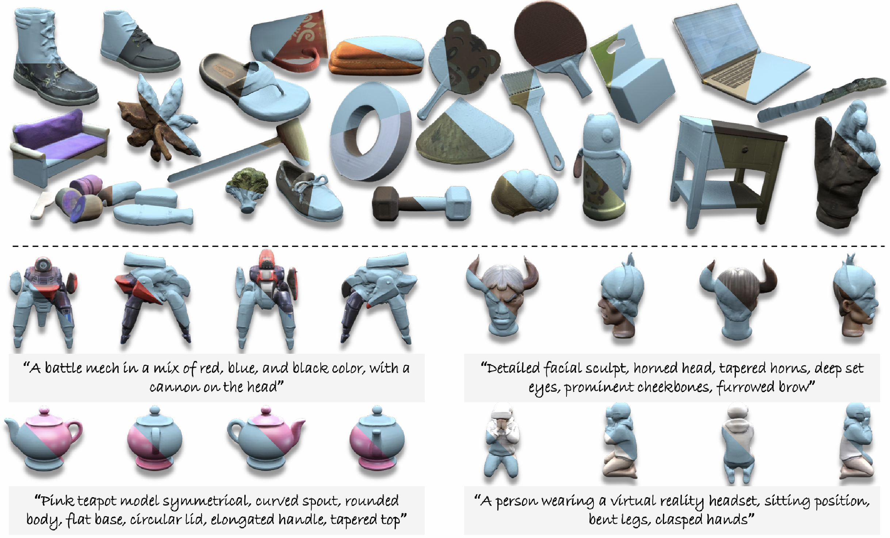

<div align="center">
  
<h1 class="title is-1 publication-title"><span style="color: #AE2142;">DiMeR</span>: <span style="color: #AE2142;">Di</span>sentangled <span style="color: #AE2142;">Me</span>sh <span style="color: #AE2142;">R</span>econstruction Model</h1>

<a href="https://lutao2021.github.io/DiMeR_page/"></a>
<a href="https://arxiv.org/abs/2504.17670"></a> 
<a href="https://huggingface.co/spaces/LutaoJiang/DiMeR"></a>
<a href="https://huggingface.co/spaces/LTT/DiMeR"></a>

<div class="is-size-5 publication-authors">
  <span class="author-block">
    <a href="https://lutao2021.github.io">Lutao Jiang</a><sup>1*</sup>,</span>
  <span class="author-block">
    <a href="https://ltt-o.github.io/JiantaoLin.github.io/">Jiantao Lin</a><sup>1*</sup>,</span>
  <span class="author-block">
    <a href="https://khao123.github.io/">Kanghao Chen</a><sup>1*</sup>,</span>
  <span class="author-block">
    <a href="https://g3956.github.io/wenhangge.github.io/">Wenhang Ge</a><sup>1*</sup>,</span>
  <br>
  <span class="author-block">
    <a href="https://abnervictor.github.io/2023/06/12/Academic-Self-Intro.html">Xin Yang</a><sup>1,2</sup>,</span>
  <span class="author-block">
    <a href="#">Yifan Jiang</a><sup>1</sup>,</span>
  <span class="author-block">
    <a href="https://qc-ly.github.io/">Yuanhuiyi Lyu</a><sup>1</sup>,</span>
  <span class="author-block">
    <a href="https://zhengxujosh.github.io/">Xu Zheng</a><sup>1</sup>,</span>
  <span class="author-block">
    <a href="https://www.yingcong.me/">Yingcong Chen</a><sup>1,2†</sup></span>
</div>

<div class="is-size-5 publication-authors">
  <span class="author-block"><sup>1</sup>HKUST(GZ),</span>
  <span class="author-block"><sup>2</sup>HKUST</span>
</div>

<div class="is-size-5 publication-authors">
  <span class="author-block"><sup>*</sup>Equal Contribution,</span>
  <span class="author-block"><sup>†</sup>Corresponding Author</span>
</div>

<div class="is-size-5 publication-authors">
  <span class="author-block">ljiang553@connect.hkust-gz.edu.cn,</span>
  <span class="author-block">yingcongchen@ust.hk</span>
</div>

</div>




---

#### 🗞️ News
* [2025.04] We release the model weights and a huggingface demo of text-to-3D application. Welcome to use!

---

#### 🚩 TODO List
- [x] Text-to-3D Demo
- [ ] Sparse/Single-View-Image-to-3D
- [ ] Training Code

If you find this work interesting or useful, please give me a ⭐!

---

#### 🛠️ Install
```
conda create -n DiMeR python=3.10
conda activate DiMeR
pip install requirements.txt
pip install ./custom_diffusers --force-reinstall --no-deps
pip install --no-index --no-cache-dir pytorch3d -f https://dl.fbaipublicfiles.com/pytorch3d/packaging/wheels/py310_cu121_pyt240/download.html
pip install ./extension/nvdiffrast-0.3.1+torch-py3-none-any.whl --force-reinstall --no-deps
pip install ./extension/renderutils_plugin-0.1.0-cp310-cp310-linux_x86_64.whl --force-reinstall --no-deps
```

#### 🤗 Run

```
python app.py
```
We recommend to check the evironment "CUDA_HOME" is set rightly.
If you have any questions, please feel free to open an issue.

---
#### 🌹 Acknowledgements

We sincerely thank the following open-source works.

* [Kiss3DGen](https://github.com/EnVision-Research/Kiss3DGen)
* [PRM](https://github.com/g3956/PRM)
* [InstantMesh](https://github.com/TencentARC/InstantMesh)
* [StableNormal](https://github.com/Stable-X/StableNormal)
* [Lotus](https://github.com/EnVision-Research/Lotus)

---
#### 📕 Citation

```
@article{jiang2025dimer,
  title={DiMeR: Disentangled Mesh Reconstruction Model},
  author={Jiang, Lutao and Lin, Jiantao and Chen, Kanghao and Ge, Wenhang and Yang, Xin and Jiang, Yifan and Lyu, Yuanhuiyi and Zheng, Xu and Chen, Yingcong},
  journal={arXiv preprint arXiv:2504.17670},
  year={2025}
}
```
